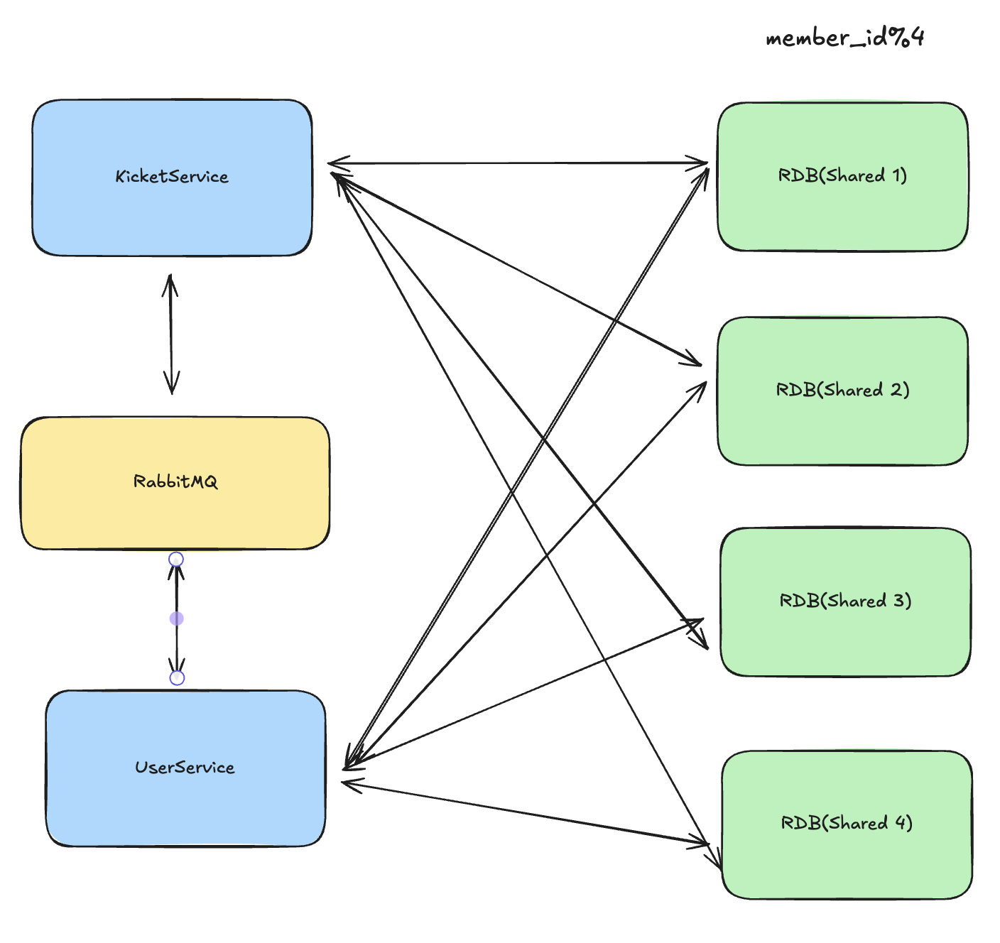

# 1주차 스타트!!

## 디프만 콘서트 예매 시스템(가칭)

한 공연장의 좌석을 온라인으로 판매하려고 합니다.
사용자는 좌석 배치를 보고 원하는 좌석을 선택한 뒤 결제할 수 있어야 하며, 이미 판매된 좌석은 다시 판매되면 안 됩니다.
또한 좌석을 고른 뒤 일정 시간 안에 결제를 완료하지 않으면 좌석은 자동으로 풀려야 합니다.

### 가정

- 단일 이벤트(공연 1회차)만 다룬다.
- PC 웹 기준(모바일 고려는 선택).
- 외부 결제는 **“결제 성공 콜백이 온다”** 가정(실제 결제 연동은 모의).

  ## 기능적 요구사항

    - 사용자는 해당 페이지에서, 전체 좌석, 열, 그리고 좌석 상태에 대해 조회 할 수 있다.
    - 좌석은 **선택 → 결제 → 확정(판매완료)** 의 흐름을 가진다.
    - 결제가 완료된 좌석은 다시 판매될 수 없다.
    - 사용자는 예매가 완료되기까지 동기적으로 응답을 확인해야 한다.
    - 사용자는 자신의 예매 내역을 조회할 수 있다.
    - 사용자는 예매가 완료되기까지 대기열에서 대기해야한다.
    - 좌석 예매와 관련된 로그를 저장하고 조회해야한다.

  ## 비 기능적 요구사항.

    1. 중복 판매가 되어서는 안된다.
    2. 예매가 열리는 순간 피크 사용자가, 20만명이라고 가정한다.
    3. 전체 좌석은 만오천석이라고 가정.
    4. 좌석 조회는 평균 응답시간 <150ms 이내 → p(95) < 150ms

  ## 이런거를 해보면 좋아요

    - ERD 설계
    - 아키텍처 다이어그램 그리기

  ## (Optioanl) 추가 고민해보면 좋을만한 사항들

    - ✅ 동시에 여러 사람이 같은 좌석을 선택하면 어떻게 막을까?
    - ✅ 결제 실패/타임아웃이 발생하면 좌석 상태를 어떻게 돌려놓을까?
    - 같은 주문 요청을 여러 번 보내면 어떻게 처리할까?
    - 같은 주문 요청이 여러 번 오면(중복 클릭 등) 어떻게 막을 수 있을까?
    - ✅ 수십만 명이 동시에 접속하면 어떤 부분이 가장 먼저 병목이 될까?
    - ❌ 00명이 대기중입니다.와 같은 대기열을 어떻게 만들수 있을까?

## 개략적 규모 추정

- 1개의 공연, 좌석 15000개
- Peak DAU 200000(20만)
- Peak RPS 200000
- 하나의 좌석 평균 13명이 경쟁

# V1

### API 설계

- 좌석 조회(GET /seat)
- 좌석 선택(POST /seat)
- 좌석 결제(POST /seat/confirm , Third-Party)

### ERD


MySQL Reaptable read

```sql
Table seat {
  id bigint [primary key]
  member_id bigint
  payment_status enum('pending', 'paid', 'failed')
  row bigint
  col bigint
}

Table member {
  id bigint [primary key]
  username varchar
  nickname varchar
  password varchar
  role enum('user','admin')
  created_at datetime 
}

Ref: seat.member_id > member.id
```

### Architecture

RDB는 MySQL Repeatable read라고 가정


# V2(예약 동시성)

V1에서 발생할 수 있는 예약 동시성을 고려해보자


사용자 두명이 남은 좌석 1개를 가지고, 좌석을 B사용자가 선택하였지만, A사용자도 선택하여 자리 1개를 두명 예약하는 상황이 벌어질 수 있다. Repeatable Read환경을 고려해볼때, 두 사용자 모두 같은 테이블 상황을 보게되기 때문에 일어날 수 있는 상황이다.

따라서 좌석 위치에 대한 UNIQUE 제약조건을 추가하여 SQL Exception을 유도할 수 있다.

*책에서는 낙관적, 비관적 락에 대한 내용이 나오는데, 굳이 써야 하는 이유를 모르겠다*


# V3 타임아웃

한가지 조건을 추가해보겠다. 좌석 선택후에 3분안에 결제실패시 좌석 상태가 롤백된다고 가정한다. 이때 롤백은 API 서버 내부에서 스케줄링 한다

### 기존 Seat 컬럼을 삭제 VS 쿼리를 변경

기존에는 Seat 컬럼에서 아직 예약되지 않은 컬럼만을 조회한다고 했다면 이제 시간이 지난 컬럼을 삭제할 것인지, 조회 컬럼의 연산을 변경해야하는지 선택해야한다. 삭제후 재생성은 인덱싱 제거, 생성에 대한 비용을 생각해본다면 비용이 높지만, 시스템 일관성과 컬럼의 의미가 변경된다는 점에서 삭제하는게 더 좋은 선택이라고 생각한다.

삭제에 따라 동시성문제는 아직 발생하지 않는다.

# V4 반복되는 요청 쿼리

반복되지만 비용이 높은 쿼리가 있다. 좌석 조회 API이다. 모든 유저에게 동일한 데이터를 제공하기 때문에 캐싱을 고려해볼 수 있다.

여기서는 redis대신 memcached를 사용하겠다. memcached를 사용한 이유는 redis의 경우 memcached 디스크에 저장을 지원하지만, 좌석 조회 데이터를 디스크에 저장하기 않고, cache server에 장애가 발생했을경우, 기존과 동일하게 RDB을 경유하도록 처리할 예정이기 때문이다(*이게 옳은 방식인지는 모르겠다*)


### Cach에서의 동시성 이슈

cach에 의한 동시성 문제는 없을까? 일단 cache에는 트랜잭션을 지원하지 않는다(*memcached는 아닐 수 있는데 일단 Redis는 제공안함, Redis에서 단일 키에 대한 단일 연산 원자성을 보장하는 기술이 있긴한데, 없다고 생각하겠다.*)

<aside>
💡

트랜잭션 복기

- 원자성 (Atomicity)
- 일관성 (Consistency)
- 독립성 (Isolation)
- 지속성 (Durability)
</aside>

따라서 cach에 저장된 좌석 정보를 100% 신뢰할 수 없다. 그럼에도 사용한다. 왜나하면 이미 좌석 정보 조회 API는 100% 신뢰하기 어렵다(V2을 다시보거나, *티켓팅 경험을 되살려보면…*)

### Cache update

캐시 업데이트를 변경에 발생함에 따라 진행해야할까, 주기적으로 모든 좌석에 대한 전체 업데이트를 해야할까?

후자와 전자를 모두 합쳐야한다고 생각한다. 왜나하면 전자만을 채택할경우, 동시성 문제를 직접 겪게되기 때문이고, 후자의 경우 full scan에 대한 오버헤드를 감수해야하기 때문이다(다른 분들 의견이 궁금하다)

## ETC 서드 파티 병목

한가지 제어할 수 없는 영역이 있다. 서드 파티 결제 모듈이다. 결제 모듈도 RSP 200000을 감당할 수 있을까? 어렵다고 본다.

따라서 여러개의 서드파티를 사용해야하지 않을까? PG에서 제공되는 페이지로 redirect하는 형식으로 결제를 진행하는데 있어서 여러개의 PG사의 모듈을 사용해야하고 추가적인 API를 구성한다.

- 좌석 결제 확인

기존 좌석 결제 API를 분리한 것으로 좌석 결제후 PG사를 통한 결제 과정을 API Server 쓰레드가 계속 점유하지 않고, 추후에 좌석 결제 확인요청을 통해 쓰레드 병목을 예방한다

- 좌석 조회(GET /seat)
- 좌석 선택(POST /seat)
- 좌석 결제(POST /seat/confirm , Third-Party)
- 좌석 결제 확인(GET /seat/check)

# V5 대기열

지금까지는 단일 서버를 전제로 서버를 구성하였다.

단일 서버로 RPS 200000을 감당하려면 단일 컴퓨터로는 거이 불가능하지 않을까…(내 경험으로 t2.micro가 RPS 100~500으로 알고 있다)

Scale out으로만  400대의 컴퓨터가 필요하다. 따라서 200000을 충족하기 보다는 대기열 환경이 필요하다. 다만여기서 대기열이란, 예매 시스템 전반의 인가의 의미도 가지고 있다.

~~API gateway에서 Rabbitmq으로 대기열을 보낸후 통과한 대기열은 API Server를 통해 인가 세션을 발급 받는다.~~

<aside>
💡

~~토큰을 사용하지 않는 이유는 사용자가 탈취후 악용할 여지가 있어서 세션을 통해 IP가 변경된 경우 세션 인가를 방지하기 위함이다.~~

</aside>


~~해당 세션을 통해 기존 API를 사용할 수 있게 된다(대기열을 통과하면 예약을 진행할 수 있다)~~


이전 아키텍쳐를 수정하였다. 활성 사용자 수를 조절할 수  없기 때문이다. 모든 요청이 메세지큐를 통과하는 대신에 인가 유저를 토큰으로 관리한다

## V6 분산 환경

다시 단일 서버를 보자 대기열을 통해 API서버의 요청량을 제어할 수 있다. 그러면 다 해결한 것인가? 그렇지 않다. RPS 20만개의 요청을 RPS 10만개로 줄었다고 가정하면 단일서버로는 해결할 수 없다. 먼저 DB를 보자 샤딩을 하기 적절한가?


seat 테이블을 집중해보자 seat테이블은 계속 삽입된다. 주기적으로 seat 테이블 풀스캔을 진행한다(Cache 동기화), 또한 member 단일 id에 해당하는 JOIN이 진행된다(예약 현황)

따라서 memberid기준으로 사딩을 진행해야한다.


API Server보겠다. MSA가 좋을까? 로드밸런서 + 모놀리틱이 좋을까?

이건 요구사항을 더 봐야할거 같은데…

### MSA



DB 관리할 수 있어요???