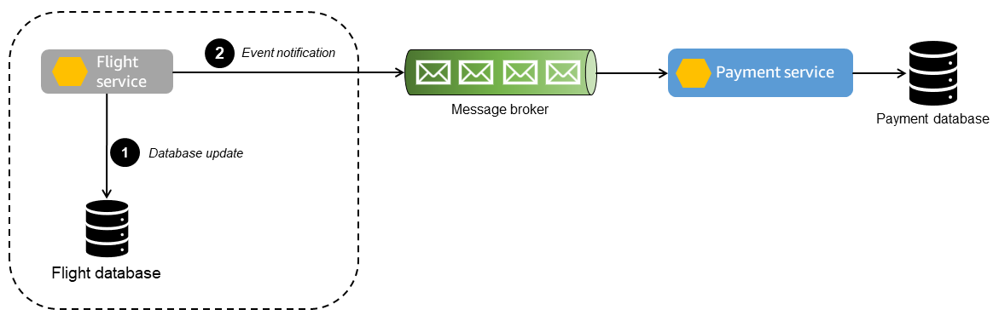

# [9/12] 2주차 - 실시간 배달 추적 시스템 설계

생성일: 2025년 9월 2일 오전 3:41

## 📦 시스템 개요

한국의 주요 도시에서 운영되는 음식 배달 플랫폼입니다. 고객이 앱으로 주문하면 근처 라이더를 자동으로 매칭하고, 픽업부터 배달까지 실시간으로 추적할 수 있는 시스템을 설계하세요. 

### 🎯 비즈니스 목표

- 평균 배달 시간 30분 이내
- 고객 만족도 향상 (실시간 추적)

## 📋 기능적 요구사항

### [고객 기능]

1. **주문하기**
    - 음식점 선택 및 메뉴 주문
    - 배달 주소 입력 (GPS 또는 직접 입력)
    - 예상 도착 시간 확인
2. **실시간 추적**
    - 주문 상태 실시간 업데이트 (주문접수 → 조리중 → 픽업 → 배달중 → 완료)
    - 라이더 실시간 위치 지도에 표시
    - 예상 도착 시간(ETA) 동적 업데이트
3. **알림**
    - 주문 상태 변경 시 푸시 알림 ⇒ 분산 환경 주문 상태 동기화 가능해야
    - 라이더 도착 임박 알림 (100m 이내)
    

### [라이더 기능]

1. **배달 수락/거절**
    - 새 배달 요청 알림
    - 배달 정보 확인 (거리, 예상 수익)
    - 15초 내 수락/거절 결정
2. **배달 관리**
    - 최적 경로 제공
    - 상태 업데이트 (픽업 완료, 배달 완료)

### [음식점 기능]

1. **주문 관리**
    - 주문 접수/거절
    - 예상 조리 시간 입력
    - 픽업 준비 완료 알림
    

## 📊 비기능적 요구사항 (수치 포함)

### 규모 (Scale)

### 위치 데이터

```yaml
사용자:
  - 전체 가입자: 3000만명
  - MAU: 1000만명
  - DAU: 300만명
  - 피크 시간 동시 접속: 100만명

라이더:
  - 전체 등록: 100만명
  - 일일 활성: 20만명
  - 피크 시간 활성: 5만명

음식점:
  - 전체 등록: 50만개
  - 일일 활성: 10만개

주문:
  - 일일 주문: 500만건
  - 피크 시간 주문: 10만건/분 (점심 12-1시, 저녁 6-7시)
  - 평균 배달 시간: 30분
```

```yaml
라이더 위치 업데이트:
  - 전송 주기: 5초
  - 피크 시간 라이더: 5만명

고객 위치 조회:
  - 배달 추적 새로고침: 10초마다
  - 동시 추적 고객: 50만명
```

### 성능 요구사항

### 데이터 저장

```yaml
응답 시간:
  - 주문 생성: < 1초
  - 위치 업데이트: < 500ms
  - 매칭 결과: < 2초
  - 지도 로딩: < 2초
  - 알림 전송: < 1초

처리량:
  - 주문 API: 10,000 TPS
  - 위치 업데이트 API: 20,000 TPS
  - 위치 조회 API: 100,000 TPS
  - 매칭 서비스: 5,000 TPS

가용성:
  - 전체 시스템: 99.9% (월 43분 다운타임)
  - 핵심 기능(주문/매칭): 99.95%
  - 부가 기능(추적): 99.5%
```

```yaml
저장 기간:
  - 주문 데이터: 영구 보관
  - 위치 이력: 7일 (법적 요구사항)
  - 상세 위치: 24시간 (5초 단위)
  - 집계 위치: 7일 (1분 단위)
```

## [필수 계산 항목]

### 인프라 규모 산정

```markdown
□ 위치 데이터 처리 서버 대수
□ 매칭 엔진 서버 대수
□ API 서버 대수
□ 데이터베이스 용량 및 IOPS
□ Redis 메모리 용량
□ 메시지 큐 처리량
```

## 🏗 아키텍처 설계 포인트

1. 위치 데이터 처리

2. 실시간 시스템

3. 확장성 전략

## 💡 주요 기술적 도전 과제

### 1. 🗺 "Hot Spot 문제"

**문제**: 강남역 같은 특정 지역에 주문과 라이더가 집중

```yaml
강남역 반경 1km:
  - 음식점: 6,000개
  - 피크 시간 주문: 10,000건/분
  - 활성 라이더: 1,000명
  - 위치 업데이트: 200/sec
```

### 2. 🔄 "상태 일관성"

**문제**: 분산 환경에서 주문 상태 동기화

```yaml
상태 전이:
  주문접수 → 조리중 → 픽업대기 → 픽업완료 → 배달중 → 배달완료

동시 업데이트:
  - 고객 앱
  - 라이더 앱
  - 음식점 태블릿
  - 관리자 시스템
```

**+) 고려 안해도 되는 포인트**

- 매칭 알고리즘: 어떻게 가까운 사람한테 매칭해줄까 기타 등등
- 하나의 라이더가 하나의 음식만 배달한다고 가정
- 알림 관련 부분은 나이브하게 설계해도 괜찮음.
- ✨ **중요한것은 어떻게 위치 정보를 안정적이고 신뢰성있게 받을수 있을까**
- 결제와 같은 외부 의존성은 고려하지 않는다.

---

### 위치 데이터 처리

> 빠르게 받고 가볍게 가공하여, 실시간으로 안정적이고 정확한 데이터가 제공 되어야 한다.
> 

<aside>

- 배달 주소 입력(GPS 사용 시)
- 예상 도착 시간 확인
- 실시간 추적
    - 라이더 실시간 위치 지도에 표시
    - 예상 도착 시간(ETA) 동적 업데이트
</aside>

❗  클라이언트 ⇒ 서버로 좌표 어떤 방식으로 ‘빠르게’ 전송할 것인가? 
 `gRPC`의 client-streaming를 통해 클라이언트가 스트림을 열고 연속으로 좌표 전송이 가능하다. 
  ⇒ 좌표 같이 작고 실시간 데이터 전송이 필요한 환경에서 오버헤드가 적다. 

[gRPC 스트리밍이 어떻게 API를 더 빠르고 더 안정적으로 만들어 줄 수 있는가](https://apidog.com/kr/blog/grpc-streaming-2/)

```java
라이더 위치 업데이트:
  - 전송 주기: 5초
  - 피크 시간 라이더: 5만명

고객 위치 조회:
  - 배달 추적 새로고침: 10초마다
  - 동시 추적 고객: 50만명
```

```java
syntax = "proto3";

message Position {
  string rider_id        = 1;   // 고유 ID
  double latitude        = 2;
  double longitude       = 3;
  int64  device_time_ms  = 4;   // 기기 시간(모노토닉 권장)
  uint64 seq             = 5;   // 전송 순서(단조 증가)
  float  accuracy_m      = 6;   // 수평 정확도
  float  speed_mps       = 7;   // 옵션: 속도
  float  heading_deg     = 8;   // 옵션: 방위각
  string session_id      = 9;   // 재접속 식별
  map<string,string> tags= 10;  // 배터리, 네트워크 등 메타
}

message StreamAck {
  uint64 last_acked_seq  = 1;
}

service LocationService {
  rpc StreamPositions (stream Position) returns (StreamAck);
}
```

❗ 서버에서 좌표를 어떤 방식으로 받을 것인가? 

방법 1. 서버가 직접 Redis I/O 
: 속도는 빠르지만, Redis 가 느려진다면 대기/병목으로 서버 타임아웃 발생 가능성 있음. 
   ⇒ **생산자(라이더 앱)**와 **소비자(DB)**의 속도 차이를 맞추기 힘듦

방법2. **브로커 사용(Kafka, RabbitMQ) ⇒ 완충 역할**
: 서버(API)는 좌표를 받자마자 브로커에 이벤트 발행만 하고 끝나게 되고, 
  브로커는 **중간 버퍼 역할**을 하면서 메시지를 큐에 안전하게 저장.
   ⇒ 컨슈머 워커는 자기 속도에 맞게 읽게 되므로, 속도 차이나 데이터 유실 가능성 적음
       확장 측면에서도, 컨슈머만 늘리면 되므로 높은 트래픽에 유여한 대응 가능
[EX] 토픽 : `loc.positions.v1` , 파티션 키 : `rider_id` (라이더별 순서 보장) 

❗  소비자 워커가 좌표 저장/조회 ⇒ `Redis ZSET(정렬 집합) + Geo 명령어 구조`

- ZSET의 `score`에 Geo 명령어를 통한 위도/경도를 변환한 값을 저장
- 빠른 I/O에 최적화, `geo:rider:{cell}` , `geo:stores:{cell}` , `geo:orders:{cell}`
셀 = 지오해시 단위 지역(강남구), 상태 값도 Redis Hash 에 같이 저장 가능
- 실시간 지도 표시 & 위치 추적 : Redis의 GEORADIUS(주변 좌표 탐색)나 geohash 기반 쿼리 사용

[Geo 사용법]

```java
// 지리공간 인덱스에 여러 위치 추가
> GEOADD bikes:rentable -122.27652 37.805186 station:1
(integer) 1
> GEOADD bikes:rentable -122.2674626 37.8062344 station:2
(integer) 1
> GEOADD bikes:rentable -122.2469854 37.8104049 station:3
(integer) 1
```

```java
// 주어진 위치에서 반경 5km 이내의 모든 위치를 찾고 
// 각 위치까지의 거리를 반환
> GEOSEARCH bikes:rentable FROMLONLAT -122.2612767 37.7936847 BYRADIUS 5 km WITHDIST
1) 1) "station:1"
   2) "1.8523"
2) 1) "station:2"
   2) "1.4979"
3) 1) "station:3"
   2) "2.2441"
```

[장점]

- 간단하게 **반경 검색**, **거리 계산** 가능

[한계]

- 같은 key(ZSET)에 모든 좌표가 들어가므로 **핫스팟 문제 발생**
대규모 트래픽 분산 위해선 → geohash prefix를 직접 key로 분리해야**.
(**Geo 자체에는 자동 분할(sharding) 기능 없음)

[https://redis.io/docs/latest/develop/data-types/geospatial/](https://redis.io/docs/latest/develop/data-types/geospatial/)
[https://velog.io/@jjoyra/내-주변-사용자-찾기-2.-Redis-Geospatial로-가까운-사용자-찾기](https://velog.io/@jjoyra/%EB%82%B4-%EC%A3%BC%EB%B3%80-%EC%82%AC%EC%9A%A9%EC%9E%90-%EC%B0%BE%EA%B8%B0-2.-Redis-Geospatial%EB%A1%9C-%EA%B0%80%EA%B9%8C%EC%9A%B4-%EC%82%AC%EC%9A%A9%EC%9E%90-%EC%B0%BE%EA%B8%B0)

<aside>

### 💥💥 Hot Spot 문제 (특정 지역에 주문과 라이더가 집중되는 경우)

```yaml
강남역 반경 1km:
  - 음식점: 6,000개
  - 피크 시간 주문: 10,000건/분
  - 활성 라이더: 1,000명
  - 위치 업데이트: 200/sec
```

❗ 발생 원인
Redis의 단일 Key(Geo Sorted Set)에 주문이나 위치 업데이트 같은 쿼리 작업이 몰리게 되면,
해당 Key를 담당하는 단일 스레드에서 **키 단위의 지연 & 병목 발생**

Geo 구조 같이 동일 좌표계로 관리한다면, 강남역과 같은 밀집 지역에 분당 10,000건의 주문이 특정 Key 에 몰리게 된다는 것

✨ 해결책  ⇒ `지오해시(geohash)` 데이터 구조
지오해시를 통해 특정 지역만 요청이 몰리면, 작은 셀로 더 작게 분리하는 방식으로 대응 가능.

<aside>

**지오해시(geohash)**
지구를 격자(정사각형 셀)로 나눠 문자열로 표현하는 방법. (GPS 좌표 ⇒ 이진수 ⇒ 특정 규칙에 따라 32진수로 변환) 
⇒ ‘지역을 쪼개는 작업을 어디까지 진행할 것인가’ Geohash 의 레벨 결정

- **인근 탐색이 단순** → 같은 prefix를 가진 geohash는 가까운 영역
- **핫스팟 분산** → 특정 지역만 요청이 몰리면 작은 셀로 더 잘게 쪼개서 관리 가능

https://redis.io/docs/latest/develop/data-types/sorted-sets/

https://guzene.tistory.com/337

</aside>

🌟 피크 시간대의 운영 방안

- 좌표를 전달 받는 컨슈머 워커 ⇒ 배치로 폴링(200~1000건/폴)을 통해 처리량 최적화
- 오토 스케일링
⇒ 파티션 별로 `log_end_offset - current_offset` 합계 = `lag`(지연) 건수
`lag_seconds` = `lag / 현재 유입률(msg/s)` ⇒ lag 가 20000 이고, 유입이 10,000 msg/s 라면, ‘읽어야 할 메시지’ 가 2초 밀린 것을 의미한다.
    
    `lag_seconds > 2s`가 1~2분 지속 & P95 처리 시간 이 목표 초과 ⇒ 컨슈머 늘리기 (파티션까지도)
    
- 멱등성`(rider_id, last_seq)`로 중복 방지
⇒ 재시도/재처리 때문에 **같은 이벤트를 두 번** 써버리는 상황이 생길 수 있음.
따라서, 라이더별로 마지막 처리 시퀀스(last_seq)와 같은 값을 기록하여, 처리할 메시지의 `seq`가 `<= last_seq`면 **드롭**
    - 아주 빠른 경로: **인메모리 LRU 캐시**(프로세스 내) + 백업으로 **Redis Hash**
    - 강한 보존/리플레이: Kafka **compacted topic**에 `(rider_id → last_seq)` 저장도 가능

- Hash 셀 기본 단위 `7자`
: 셀 당 멤버 수(5만) 또는 QPS(2k/s) 넘는다면, `8자`로 키 분할하도록 승격
 비혼잡 시간대엔 셀 단위 축소 ⇒ 메모리 축소
- 오프라인 라이더 혹은 완료된 주문건에 대해 TTL or Sorted Set의 ZREM 을 통해 
요구사항에 맞도록 주기적으로 메모리 청소
- 
</aside>

레디스 한계 

300GB ⇒ 클러스터 고려한다면 1TB 필요 

### 실시간 상태 변경 (분산 환경)

> 최신 상태값 빠르게 반영하면서, 서버는 최소한의 작업 및 I/O
주문접수 → 조리중 → 픽업대기 → 픽업완료 → 배달중 → 배달완료
> 

상태 이벤트 흐름 
: 주문/매칭/픽업 등 상태 변경 시 ⇒ 서비스 DB I/O & Outbox 테이블에 이벤트 기록 ⇒ 별도의 비동기 워커(CDC/폴러)가 Outbox를 읽어 브로커에 이벤트 발행

❓ 이벤트를 별도의 RDB 테이블(Outbox) 에서 관리하는 이유

- “발행해야 할 이벤트”를 먼저 RDB에 영속화해두면, 장애가 나더라도 이후 안전하게 재발행 가능
- 상태 변경이 DB에는 반영됐지만 브로커에는 못 간다는 불일치 상황 방지
- Outbox에 `eventId`, `orderId + version` 를 저장 → 낮은 버전 이벤트는 무시.
& 동시에 여러 클라이언트가 상태를 바꿔도 “상태 역행” 차단
- `orderId` 단위로 파티셔닝하여 읽고 발행하면, 주문별 이벤트 순서를 일관되게 유지 가능
    
    ```java
    INSERT INTO Outbox(eventId, orderId, version, payload, status)
    ```
    
    ⇒ 여기서 발행 워커가 `orderId`를 Kafka 메시지 key로 설정해서 보내면, Kafka가 같은 `orderId` 이벤트는 항상 같은 파티션에 저장
    
- 브로커나 컨슈머쪽이 느려져도 Outbox 가 완충/버퍼 역할 수행 ⇒ 분산 환경 싱크 맞추기 쉬워짐‘

❓ Outbox 말고 유사한 대안은 없을까 ? 

- **Kafka 내부 트랜잭션**
    - Kafka 토픽과 Kafka 내 컨슈머 offset을 원자적으로 묶어 **“중복 없는 정확히 한 번”** 보장.
    - 그러나 **도메인 DB와 카프카 간 원자성은 해결 못 함**. (여전히 이중 쓰기 문제 존재)  ⇒ OutBox 패턴 등장 배경
- **2PC(분산 트랜잭션)**: DB와 브로커를 한 분산 트랜잭션으로 묶음
    - 강한 일관성 대신 **운영 복잡/지연/결합도↑**
- Saga 패턴 : 여러 서비스의 상태 변경을 보상 트랜잭션으로 맞춤.
    - 흐름/보상 설계가 복잡, 단일 DB↔브로커 원자성 문제엔 투머치

<aside>

### Transactional Outbox Pattern



**해당 패턴**은 상태 변경과 Outbox 테이블에 이벤트 레코드 삽입을 **하나의 트랜잭션**으로 묶어 한 번의 쓰기로 원자성과 정합성을 보장한다. 
분산 시스템에서 흔히 발생하는 **이중 쓰기 문제**를 해결하는 디자인 패턴이다.  (**이중 **쓰기 **문제 : 위의 두 작업이 **분리되어 수행될 때** 두 작업 간 동기화가 어긋나면서 정합성이 깨지는 상황)

이 패턴은 서비스의 데이터 변경을 반영하는 이벤트를 메시지 브로커에 안전하게 발행하면서, 트랜잭션의 일관성을 유지하고 장애 상황에서도 데이터 손실을 방지하는 데 중요한 역할을 한다. (DB 쓰기와 이벤트 발행의 원자성 보장 + 최소 I/O)

[https://docs.aws.amazon.com/ko_kr/prescriptive-guidance/latest/cloud-design-patterns/transactional-outbox.html](https://docs.aws.amazon.com/ko_kr/prescriptive-guidance/latest/cloud-design-patterns/transactional-outbox.html)
[https://github.com/aws-samples/transactional-outbox-pattern](https://github.com/aws-samples/transactional-outbox-pattern)


</aside>

### 확장성

> ❓고객/라이더/매장/관리자가 주문 상태를 확인할 때마다 **DB에 직접 조회 쿼리를 날릴 것인가 ?**
> 

**✨ CQRS(읽기/쓰기 연산 분리) 도입**

⇒ 쓰기 연산보다 읽기 연산의 빈도가 높을 것이므로, 두 연산을 분리하여 읽기 연산 별도의 스케일 아웃 고려 가능. 

- 쓰기 모델(Command): 상태 전이 & Outbox 트랜잭션 담당 ⇒ I/O 최소화 및 쓰기 전용 DB 도입
- 읽기 모델(Query)
    - Outbox 레코드를 통해 발행된 이벤트 구독 ⇒ 읽기 전용 DB 접근(Redis, ElasticSearch)
    - 특정 시간대·지역·매장에 읽기 트래픽 집중 → 읽기 전용 저장소를 파티셔닝/샤딩하여 탄력 대응
    - 브로커 이벤트를 받아 **Redis/Elasticsearch 등**으로 `’읽기 전용 뷰’`를 구성
    ⇒ 가장 최신 상태값만 빠르게 업데이트 & 고객/라이더/매장/관리자 는 여기로만 접근