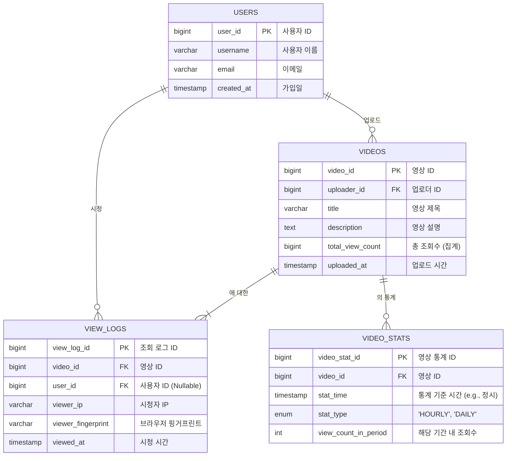
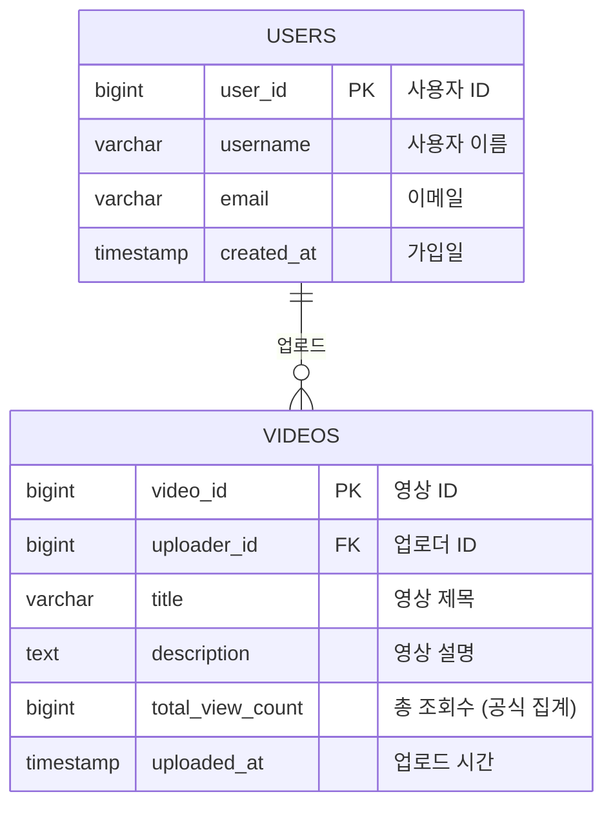
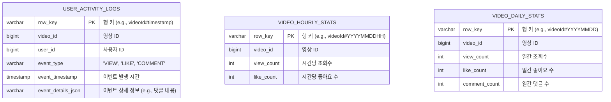

## **대규모 조회수 및 랭킹 시스템 설계**

### **0. 문제 정의 및 요구사항**

### **A. 시스템 정의 및 배경**

- **시스템:** 조회수 시스템 (View Count System)
- **배경:** 유튜브와 같이 하루 수백만 개의 콘텐츠가 업로드되고, 수십억 개의 콘텐츠를 보유한 대규모 플랫폼을 가정. (일일 업로드 약 260만 개, 총 비디오 약 43억 개)

### **B. 기능적 요구사항**

1. **조회수 카운팅:**
    - 사용자 조회 시 실시간 조회수 증가.
    - **중복 조회 방지:** 짧은 시간 내 중복 조회는 1회만 카운트.
    - **Bot 필터링:** 검색 엔진 크롤러, 스크래핑 봇 등의 조회는 제외.
    - **유효 조회 판정:** 최소 체류시간(예: 3초) 이상인 경우만 카운트.
2. **조회수 조회 및 표시:**
    - 사용자가 새로고침하면 최신 조회수 확인 가능 (기본).
    - UX 향상을 위해 화면 이동 없이 실시간으로 조회수 업데이트 (목표).
    - **응답 속도:** 조회수 표시 요청에 5ms 이내 응답.
3. **통계 및 분석 기능:**
    - **시간별 통계:** 시간/일/주/월별 조회수 집계.
    - **인기 콘텐츠 랭킹:** 실시간/일간/주간 인기 순위 제공.
    - **(Optional) 지역별 분석:** 국가/도시별 조회 패턴 분석.

### **C. 규모 및 성능 요구사항**

| 지표 | 요구사항 |
| --- | --- |
| 일 총 조회 요청 | 10억 건 |
| 피크 시간 TPS | 초당 100만 조회 (오후 8-10시) |
| 동시 활성 사용자 | 100만 명 |
| 총 콘텐츠 수 | 1,000만 개 (초기 가정) |
| 조회수 증가 처리 시간 | 10ms 이내 |
| 조회수 조회 응답 시간 | 5ms 이내 |
| 실시간 반영 지연 | 최대 30초 |

### **D. 비기능적 요구사항**

- **정확성 vs 성능의 균형:**
    - **실시간 정확도:** 95% (약간의 오차 허용).
    - **최종 정확도:** 99.9% (배치 보정 후).
    - **중복 제거율:** 90% (완벽한 중복 제거보다는 성능 우선).
- **확장성 및 가용성:**
    - **시스템 가용률:** 99.9% 이상.
    - **수평 확장:** 트래픽 증가 시 서버 추가로 선형 확장 가능.
    - **장애 복구:** 조회수 데이터 유실 없이 5분 이내 복구.
- **데이터 보호:**
    - **조회수 조작 방지:** 비정상적인 조회 패턴 탐지 및 차단.
    - **데이터 백업:** 시간별 증분 백업, 일별 전체 백업.

---

### **1단계: 요구사항 분석 및 설계 (초당 1,000건)**

### **🤔 핵심 질문 1: 5ms 내 실시간 조회수 표시를 하려면 어떠한 기술을 써야 하나?**

- **사고 과정:**
    - 5ms는 사용자의 요청이 데이터베이스까지 왕복하기에는 물리적으로 불가능에 가까운 시간입니다. 이는 데이터가 네트워크 지연 시간이 거의 없는 곳, 즉 **메모리**에 있어야 함을 의미합니다.
    - 따라서 조회수를 표시하는 '읽기(Read)' 요청은 RDBMS가 아닌 Redis와 같은 인메모리 캐시에서 직접 처리해야 합니다.
    - 또한, 사용자가 새로고침 하지 않아도 조회수가 오르는 '실시간' 경험을 제공하려면, 서버가 클라이언트로 데이터를 밀어주는(Push) 기술인 웹소켓(WebSocket)이나 SSE(Server-Sent Events)가 필요합니다.
- **결론:** **읽기 요청은 Redis에서 처리하고, 실시간 업데이트는 WebSocket을 사용합니다.**
    - 초기에는 SSE(서버가 클라이언트로 단방향 전송)도 고려할 수 있으나, 유튜브는 실시간 채팅, 알림 등 다른 기능에서도 양방향 통신이 필요합니다. 따라서 아키텍처의 단순성과 재사용성을 위해 WebSocket을 채택하는 것이 더 합리적입니다.

### **🤔 핵심 질문 2: 중복 조회를 어떻게 판정할 것인가?**

- **사고 과정:**
    1. **전제:** 비로그인 사용자의 조회수도 추적하기로 결정합니다. 따라서 User ID만으로는 부족합니다.
    2. **선택지 분석:**
        - **디바이스 고유 ID (IDFA, 광고 ID):**
            - 장점: 기기마다 고유하여 매우 정확하고, IP처럼 공유되거나 세션처럼 만료되지 않음.
            - 단점: **개인정보보호 강화로 2024년 기준 사실상 사용 불가.** iOS의 IDFA 동의율은 매우 낮고, Android 광고 ID도 사용자가 비활성화할 수 있음. 대안으로 설치 시 생성하는 UUID가 있지만, 앱 재설치 시 초기화됩니다.
        - **쿠키(Cookie):**
            - 장점: 서버에 사용자 정보를 저장할 필요가 없어 부하가 적음.
            - 단점: 사용자가 쿠키를 삭제/조작하여 조회수를 늘릴 수 있음. **모바일 앱에서는 사용 불가.**
            - 보완책: '최소 체류 시간(3초)' 조건을 결합하여 단순 반복 요청을 통한 조작을 방지. 쿠키 크기 제한(4KB)은 LRU(Least Recently Used) 알고리즘으로 최근 시청 기록만 저장하여 해결.
        - **세션(Session):**
            - 장점: 서버에서 관리하므로 쿠키보다 조작 가능성이 낮음.
            - 단점: 모든 비로그인 사용자의 세션 정보를 서버 메모리에 저장해야 하므로 사용자 수가 많아지면 서버에 큰 부담. 브라우저 종료 시 세션이 만료되어 재방문 시 중복으로 카운트될 수 있음.
        - **IP 주소:**
            - 장점: 구현이 간단하고 조작이 비교적 어려움.
            - 단점: 사무실, 카페 등 NAT 환경에서는 여러 사용자가 같은 공인 IP를 공유하여 정상적인 조회가 누락될 수 있음.
            - 보완책: **브라우저 핑거프린팅(Browser Fingerprinting)**을 수집하여 IP가 같더라도 다른 사용자로 구별. (브라우저 종류/버전, OS, 화면 해상도, 폰트, 시간대 등 조합)
- **결론:** **IP는 보조 수단으로 격을 낮추고, 다계층(Multi-layered) 식별 전략을 사용합니다.**
    - **로그인 사용자:** **User ID**를 최우선으로 사용합니다. (가장 정확)
    - **비로그인 웹:** **Cookie**를 기본으로 사용하되, 어뷰징 방지를 위해 **IP + 최소한의 Browser Fingerprint**를 보조 수단으로 활용합니다.
    - **비로그인 앱:** 앱 설치 시 생성하는 **고유 UUID**를 사용합니다.
    - 향후 시스템 규모가 커지면 머신러닝 기반의 패턴 인식으로 어뷰징을 고도화합니다.

### **🤔 핵심 질문 3: Bot을 어떻게 구분할 것인가?**

- **사고 과정:**
    - 봇 트래픽은 실제 사용자 조회수가 아니므로 필터링이 필수적입니다.
- **결론:** 기본적인 봇 탐지 전략을 적용합니다.
    - **HTTP 리퍼러(Referrer) 검증:** 유효한 웹사이트(우리 서비스 도메인)를 통해 들어온 요청인지 확인합니다. (가장 기본)
    - **비정상적인 시청 패턴 분석:** 비정상적으로 짧은 간격으로 여러 영상을 조회하거나, 여러 영상을 정확히 동일한 시간만큼만 시청하는 등의 패턴을 탐지하여 차단합니다.

### **🌟 1단계에서 키울 수 있는 역량**

- **요구사항 명확화 능력:** 애매한 요구사항(e.g., '조회수')을 구체적으로 정의하는 능력.
- **기본 설계 사고:** 복잡한 문제도 단순한 구조에서부터 시작하여 점진적으로 발전시키는 접근법.
- **데이터 모델링:** 조회수 관련 테이블을 설계하고, 기본적인 인덱스 전략을 수립하는 능력.

---

### **2단계: 성능 최적화 (초당 10,000건)**

**목표:** DB가 병목이 되는 것을 방지하고 시스템 응답 속도를 높이기 위해 **캐시를 도입**하여 성능을 튜닝합니다.

### **🤔 핵심 질문 1: DB에 직접 쓰기 vs 캐시 활용, 어떤 전략이 좋을까?**

- **사고 과정:**
    - **DB 직접 쓰기:** 초당 10,000건의 `UPDATE` 쿼리는 DB에 엄청난 부하를 주며, 테이블 락(Lock) 경합으로 인해 시스템 전체가 마비될 수 있습니다.
    - **캐시 활용:** 메모리에서 원자적(Atomic)으로 `INCR` 연산을 수행하고, 주기적으로 DB에 배치(Batch) 업데이트를 하면 DB 부하를 획기적으로 줄일 수 있습니다.
    - **트레이드오프:** 캐시는 빠르지만 데이터 유실의 위험이 있고, DB는 안전하지만 느립니다. 조회수는 약간의 유실이 치명적이지 않으므로 성능에 우선순위를 둡니다.
- **결론:** **캐시 우선 전략을 채택합니다.** Redis에서 조회수 증가를 실시간으로 처리하고, 1분마다 스케줄러를 통해 DB에 배치 업데이트합니다.

### **🤔 핵심 질문 2: Redis/Memcached 중 어떤 것을 선택하고 왜?**

- **사고 과정:**
    - **Memcached:** 단순한 Key-Value 저장소. 멀티스레드를 지원하여 특정 상황에서 더 높은 처리량을 보일 수 있음.
    - **Redis:** 다양한 자료구조(String, List, Set, **Sorted Set** 등)를 지원. **원자적 연산(`INCR`)을 지원**하여 조회수 카운팅에 최적화. 스냅샷(RDB) 및 AOF를 통해 **데이터 영속성**을 보장. Replication을 통한 **고가용성** 구성 가능.
- **결론:** **Redis를 선택합니다.** 조회수 카운팅에 필수적인 원자적 연산, 장애 시 데이터 유실을 최소화하는 영속성 기능, 추후 랭킹 시스템 구현에 필요한 Sorted Set 등 조회수 시스템의 요구사항에 훨씬 더 적합합니다.

### **🤔 핵심 질문 3: 캐시 데이터와 DB 데이터 간 일관성을 어떻게 보장할까?**

- **사고 과정:**
    - **강한 일관성(Strong Consistency):** 캐시와 DB에 동시에 데이터를 써서 항상 일관성을 유지. 조회수 시스템처럼 쓰기 작업이 빈번한 경우 성능 저하가 극심.
    - **최종 일관성(Eventual Consistency):** 실시간으로는 불일치를 허용하되, 최종적으로는 데이터가 일치하도록 보장. 조회수는 실시간 정확도보다 최종 정확성이 더 중요.
- **결론:** **최종 일관성 모델을 채택합니다.**
    - Redis에서 실시간 조회를 처리하고, 5분마다 배치 작업으로 DB에 동기화합니다.
    - 장애로 Redis 데이터가 유실될 경우를 대비해, 로그 기반의 복구 메커니즘을 마련합니다.

### **🤔 핵심 질문 4: Write-through vs Write-back vs Write-around 중 어떤 전략?**

- **사고 과정:**
    - **Write-through:** 캐시와 DB에 **동시에** 씀. 일관성은 높지만 쓰기 속도가 DB 속도에 맞춰져 느림.
    - **Write-back:** **캐시에만 먼저** 쓰고, 특정 시점에 모아서 DB에 씀. 쓰기 속도가 매우 빠르지만, DB에 쓰기 전 캐시 장애 시 데이터 유실 위험.
    - **Write-around:** DB에만 쓰고, 캐시는 읽을 때 채움(Cache Miss). 쓰기가 빈번한 조회수 시스템에는 부적합.
- **결론:** **Write-back 전략을 채택합니다.**
    - 조회수처럼 쓰기가 압도적으로 많은 작업은 성능이 최우선입니다.
    - 주기적인 배치 동기화로 DB 부하를 최소화하고, Redis의 영속성 기능을 활용하여 데이터 유실 위험을 최소화합니다.

### **🤔 핵심 질문 5: 캐시 무효화 전략은?**

- **사고 과정:**
    - 모든 콘텐츠의 조회수를 영구적으로 캐시에 저장하면 메모리가 무한정 증가합니다. 비활성 콘텐츠 데이터는 캐시에서 제거하여 메모리를 효율적으로 사용해야 합니다.
    - **TTL(Time-To-Live) 기반:** 일정 시간 후 캐시가 자동 만료. 편리하지만, 활성 콘텐츠도 만료되어 DB 조회를 유발할 수 있음.
    - **수동 무효화:** 배치 처리 후 특정 조건에 따라 직접 삭제. 정확하지만 로직이 복잡해짐.
- **결론:** **Look-aside 패턴을 기본으로 하되, TTL을 안전장치로 활용합니다.**
    - **활성 콘텐츠:** 최근 조회된 콘텐츠는 7일의 TTL로 Redis에 캐싱합니다.
    - **비활성 콘텐츠:** 7일간 조회되지 않은 콘텐츠는 TTL 만료로 자연스럽게 캐시에서 정리됩니다. 이후 다시 조회되면 DB에서 데이터를 읽어와 캐시에 저장합니다 (Look-aside).
    - **배치 처리:** 3분마다 DB에 동기화할 때, 동기화 대상이 된 활성 콘텐츠의 TTL을 다시 7일로 갱신해줍니다.
    - 이를 통해 자주 조회되는 데이터만 캐시에 유지하여 메모리 사용을 최적화합니다.

### **🌟 2단계에서 키울 수 있는 역량**

- **캐싱 전략:** 다양한 캐시 패턴(Write-back, Look-aside)과 트레이드오프에 대한 깊은 이해.
- **성능 튜닝:** 시스템의 병목점을 식별하고, 캐시와 같은 기술로 해결하는 능력.
- **데이터 일관성:** CAP 이론을 실제 상황에 적용하여 일관성 모델을 선택하는 능력.

---

### **3단계: 분산 시스템 설계 (초당 50,000건 이상)**

**목표:** 글로벌 서비스로의 성장을 대비하여 시스템을 **수평적으로 확장(Scale-out)**하고, 대규모 트래픽을 안정적으로 처리합니다.

### **🤔 핵심 질문 1: 어떻게 샤딩할 것인가? (content_id 기반? 지역 기반?)**

- **사고 과정:**
    - **도입 시점:** 단일 DB 용량이 1TB에 근접하거나, 쓰기 TPS가 1,000을 초과하여 마스터 DB의 부하가 감당이 안 될 때 샤딩을 고려합니다.
    - **샤딩 키 선택:**
        - **content_id 기반:** `content_id % N` 방식은 특정 콘텐츠(핫 콘텐츠)에 트래픽이 몰릴 때 해당 샤드만 과부하에 걸림.
        - **지역 기반:** 사용자 위치 기반 샤딩은 지역별 트래픽 편차가 심해 균등 분배가 어려움.
        - **시간 기반:** 생성 시간 기준 샤딩은 최신 콘텐츠에만 트래픽이 집중됨.
- **결론:** **`content_id` 기반의 해시 샤딩(Hash Sharding)을 기본으로 채택하고, 핫 콘텐츠는 별도 대응합니다.**
    - **쓰기 (원본 저장)는 '콘텐츠 ID 기반 샤딩'으로**
        - 영상 원본 파일, 메타데이터, 댓글, **전 세계 총조회수**와 같은 '마스터 데이터'는 **콘텐츠 ID 해시 샤딩**을 통해 전 세계에 분산된 특정 샤드 DB에 저장합니다. 이것이 데이터의 유일한 '원본'이 됩니다.
    - **읽기 (사용자 경험)는 '지역별 캐시/CDN'으로**
        - 미국 사용자가 한국에 원본이 있는 영상을 요청하면, 시스템은 처음 한 번만 한국 DB에서 데이터를 가져옵니다.
        - 그리고 가져온 영상 파일과 조회수 같은 데이터를 **미국에 있는 캐시 서버나 CDN 엣지 서버에 복제**해 둡니다.
        - 이후 다른 미국 사용자들이 같은 영상을 요청하면, 더 이상 한국까지 오지 않고 가까운 미국 캐시 서버에서 데이터를 바로 읽어갑니다. 이를 통해 **지역 기반 샤딩의 '빠른 응답 속도' 장점을 그대로** 누릴 수 있습니다.
    - **핫 콘텐츠 문제 대응:** 특정 콘텐츠에 트래픽이 몰리면, 해당 콘텐츠의 조회수 카운터를 별도의 전용 Redis 클러스터에 복제하여 부하를 분산시킵니다.

### **🤔 핵심 질문 2: 순간적인 트래픽 폭증(Spike)에 어떻게 대응할 것인가?**

- **사고 과정:**
    1. **문제점 분석:** 바이럴 콘텐츠 발생 시 평소의 수백 배에 달하는 트래픽이 몰리면, 동기 처리 방식으로는 API 서버, Redis, DB 중 하나가 다운되고 연쇄 장애가 발생합니다. 처리 중이던 요청은 모두 유실됩니다.
    2. **버퍼의 필요성:** 급증한 요청을 임시로 안전하게 보관하고, 백엔드 시스템이 감당할 수 있는 속도로 점진적으로 처리할 중간 다리(버퍼)가 필요합니다.
    3. **메시지 큐 기술 검토:**
        - **Redis Pub/Sub:** 이미 사용 중이라 도입이 쉽고 지연시간이 거의 없지만, 메시지 영속성이 없어 서버 재시작 시 데이터가 유실됩니다. 조회수 데이터 유실 위험으로 부적합.
        - **RabbitMQ:** 설정이 간단하고 다양한 라우팅 패턴을 지원하지만, 처리량에 한계(초당 ~10만)가 있어 바이럴 트래픽 폭증 시 병목이 될 수 있습니다.
        - **AWS SQS:** 완전 관리형이라 운영 부담이 없지만, 메시지당 과금 방식이라 대용량 트래픽 발생 시 비용이 급증할 수 있으며, 지연시간이 상대적으로 김.
        - **Apache Kafka:** 디스크 순차 쓰기에 최적화되어 **초당 수백만 메시지**를 처리할 수 있는 압도적인 처리량을 가집니다. 메시지 수와 무관한 서버 비용 구조로 대용량에 경제적이며, 디스크에 로그를 저장하여 **데이터 영속성**을 보장합니다. 파티셔닝을 통해 무한한 확장도 가능합니다.
- **결론:** **Kafka를 도입하여 비동기 처리 시스템을 구축합니다.**
    - **아키텍처:** `사용자 요청 → API 서버 → Kafka Topic (버퍼링) → 조회수 처리 워커들 → Redis/DB`
    - **도입 효과:**
        1. **비동기 처리 & 성능 향상:** API 서버는 요청을 Kafka에 저장한 후 즉시(2ms 이내) 사용자에게 응답하여 빠른 사용자 경험을 제공.
        2. **디커플링 & 안정성:** API 서버와 백엔드 처리 로직을 분리. Redis나 DB에 장애가 발생해도 API 서버는 정상적으로 요청을 받을 수 있음 (장애 격리).
        3. **데이터 보장:** Kafka가 메시지를 디스크에 보관하므로, 워커에 장애가 발생해도 재시작 후 남은 메시지를 처리하여 데이터 유실을 방지 (At-least-once 보장).

### **🌟 3단계에서 키울 수 있는 역량**

- **분산 시스템 설계:** 샤딩, 복제, 파티셔닝 등 대용량 데이터 분산 처리 전략 수립 능력.
- **스트림 처리:** Kafka와 같은 도구를 활용하여 실시간 데이터 파이프라인을 설계하는 능력.
- **글로벌 아키텍처:** 다중 데이터 센터, CDN, 네트워크 지연 등을 고려한 글로벌 서비스 설계 능력.

---

---

**MySQL**

**NoSQL**

### **4단계: 데이터 활용 - 통계 및 랭킹 시스템 설계**

**목표:** 수집된 데이터를 실시간으로 가공하여 비즈니스 가치를 창출하는 통계 및 랭킹 기능을 구현합니다.

### **🤔 핵심 질문 1: 시간/일/주별 통계는 어떻게 만들까? 📊**

- **문제:** 수십억 건의 원본 로그 테이블에 직접 `GROUP BY` 쿼리를 실행하는 것은 DB를 마비시키는 행위입니다.
- **결론:** **스트림 프로세서(Stream Processor)를 도입하여 실시간으로 집계합니다.**
    - **데이터 흐름:** `Kafka 이벤트 → 스트림 프로세서(Flink, Spark Streaming 등) → 통계용 DB(OLAP, Data Warehouse)`
    - Kafka의 조회수 이벤트 스트림을 실시간으로 읽어와 시간 단위(Tumbling Window)로 집계하고, 그 결과만 통계 DB에 저장합니다. 이를 통해 원본 DB 부하 없이 거의 실시간 통계 대시보드를 제공할 수 있습니다.

### **🤔 핵심 질문 2: 실시간 인기 콘텐츠 랭킹은 어떻게 구현할까? 🏆**

- **문제:** 수백만 개의 콘텐츠 중 상위 랭킹을 DB `ORDER BY` 쿼리로 조회하는 것은 불가능합니다. 또한, 모든 영상을 하나의 랭킹 리스트에서 관리하는 것은 메모리 및 연산 낭비가 심합니다.
- **결론: '사전 필터링'과 '샤딩된 Redis Sorted Set'을 활용하여 최적화합니다.**
    1. **후보군 필터링 (Candidate Filtering):**
        - 모든 영상을 대상으로 하지 않고, **최근 24시간 내 업로드**되었거나 **최근 1시간 내 반응이 있는** 영상 등 소수의 유효 후보군(전체의 0.1% 미만)만 선별하여 연산 대상을 최소화합니다.
    2. **Sorted Set 샤딩 (Sharding):**
        - 선별된 후보들을 하나의 거대한 Sorted Set이 아닌, **지역(`ranking:kr`) 및 카테고리(`ranking:kr:game`)**별로 분리된 여러 개의 작은 Sorted Set에 저장하여 부하를 분산하고 조회를 최적화합니다.
    3. **최종 랭킹 아키텍처:**
        - **데이터 흐름:** `Kafka Events → 스트림 프로세서 → (1) 후보군 필터링 → (2) 지역/카테고리별 점수 계산 → (3) 샤딩된 Redis Sorted Sets에 ZADD`
        - **조회:** 사용자가 '한국 게임 랭킹'을 요청하면, 애플리케이션은 `ranking:kr:game` Sorted Set에 `ZREVRANGE` 명령어를 보내 상위 랭커를 매우 빠르게 조회합니다.

---

# 다른 사람들 발표를 듣고 알게된 사실들

### 1. 레디스 부하를 덜기 위한 CDN 사용

단순히 "캐시를 앞에 둔다"는 표면적인 의미를 넘어, CDN이 Redis의 부하를 줄이는 원리는 **'캐시의 계층화(Tiered Caching)'** 와 **'요청의 지역화(Request Localization)'** 에 있습니다.

### 🧐 **핵심 아이디어: "모든 유저가 Redis까지 올 필요가 없다"**

Redis는 매우 빠르지만, 결국 **중앙 집중화된 한정된 자원**입니다. 전 세계 수백만 명의 사용자가 인기 동영상 랭킹을 1초마다 조회한다면, 그 요청은 모두 여러분의 데이터 센터에 있는 Redis 클러스터로 집중됩니다. 이는 네트워크 대역폭, Redis의 CPU 및 메모리에 엄청난 부하를 줍니다.

CDN(Content Delivery Network)은 이 요청의 99%를 **사용자와 가장 가까운 물리적 위치에 있는 '엣지 서버(Edge Server)'가 대신 처리**하도록 하는 방패막 역할을 합니다.

### **심층 동작 원리**

1. **최초의 요청 (Cache Miss):**
    - 한국의 한 사용자가 '실시간 인기 동영상 랭킹' API (`/api/v1/trending`)를 요청합니다.
    - DNS는 사용자와 가장 가까운 한국의 CDN 엣지 서버로 요청을 보냅니다.
    - 엣지 서버에는 해당 API 응답 캐시가 없으므로(**Cache Miss**), 원본 서버(Origin Server, 즉 여러분의 백엔드 서버)로 요청을 전달합니다.
    - 백엔드 서버는 Redis의 Sorted Set에서 랭킹 데이터를 조회하여 JSON 형태로 응답합니다.
    - 이때 **핵심은 HTTP 응답 헤더**에 캐시 정책을 명시하는 것입니다: `Cache-Control: public, max-age=60`
        - `public`: 중간 프록시(CDN 등)가 이 응답을 캐시해도 좋다는 의미입니다.
        - `max-age=60`: 이 응답을 60초 동안 유효한 것으로 간주하라는 의미입니다.
2. **캐시 저장 (Cache Population):**
    - 한국 CDN 엣지 서버는 백엔드로부터 받은 JSON 응답과 `max-age=60` 헤더를 함께 자신의 디스크/메모리에 저장합니다.
3. **이후의 모든 요청 (Cache Hit):**
    - 다음 60초 동안, 한국에 있는 **다른 모든 사용자**가 동일한 `/api/v1/trending` API를 요청하면, CDN 엣지 서버는 원본 서버에 묻지도 않고 자신이 저장해 둔 JSON 응답을 즉시 반환합니다(**Cache Hit**).
    - **결과적으로, 이 60초 동안 Redis와 백엔드 서버는 단 한 번의 요청도 받지 않습니다.** 수천, 수만 건의 요청이 CDN 선에서 모두 차단(처리)된 것입니다.

### 🎯 **조회수 시스템에서의 구체적 활용**

- **대상**: **읽기(Read)가 매우 빈번**하고, **데이터 변경 주기가 비교적 길며(수십 초 ~ 수 분)**, **모든 사용자에게 동일하게 보이는** 데이터. (e.g., 인기 동영상 랭킹, 집계된 총 조회수)
- **비대상**: 개인화된 데이터 (e.g., 나의 구독 채널 목록), 실시간으로 자주 바뀌어야 하는 데이터, 쓰기(Write) 요청.

> 결론: CDN은 Redis를 대체하는 것이 아니라, Redis의 앞단에서 불필요한 읽기 트래픽을 흡수하는 거대한 글로벌 분산 캐시 계층입니다. 이를 통해 Redis는 소수의 쓰기(Write) 요청과 CDN이 갱신해야 하는 극소수의 읽기(Read) 요청 처리에만 집중할 수 있게 되어, 전체 시스템의 안정성과 성능이 극대화됩니다.
> 

---

### 2. ClickHouse (클릭하우스)

ClickHouse는 "MySQL보다 빠른 DB"가 아닙니다. 애초에 목적과 내부 구조가 완전히 다른, **OLAP(Online Analytical Processing, 온라인 분석 처리)** 를 위해 태어난 **컬럼 기반(Column-Oriented)** 데이터베이스입니다.

### 🧐 **핵심 아이디어: "행(Row)이 아닌 열(Column) 단위로 생각한다"**

- **MySQL (OLTP, Row-based):** `사용자 한 명의 모든 정보(ID, 이름, 이메일, 주소)`를 한 덩어리로 디스크에 저장합니다. `UPDATE a user's address` 같은 작업에 최적화되어 있습니다.
- **ClickHouse (OLAP, Column-based):** `모든 사용자의 ID 목록`, `모든 사용자의 이름 목록`, `모든 사용자의 이메일 목록`을 각각 별도의 파일로 저장합니다.

### **심층 동작 원리: 왜 분석 쿼리가 압도적으로 빠른가?**

1. **컬럼 기반 저장 (Columnar Storage):**
    - **질문:** "지난 한 달간 모든 동영상의 **평균 조회수**와 **총 시청 시간**은?"
    - **MySQL:** 수십억 건의 동영상 데이터를 **행 단위로 모두** 디스크에서 읽어온 후, 메모리에서 `view_count`와 `duration` 필드만 뽑아내야 합니다. 제목, 설명 등 불필요한 데이터까지 읽느라 I/O 낭비가 극심합니다.
    - **ClickHouse:** 디스크에서 `view_count` 컬럼 파일과 `duration` 컬럼 파일, **단 두 개만 읽습니다.** 다른 컬럼은 아예 건드리지도 않으므로 I/O가 수십 배에서 수백 배까지 줄어듭니다.
2. **압도적인 데이터 압축률:**
    - 같은 타입의 데이터가 연속으로 모여있으면 (e.g., 숫자만 쭉, 국가 코드만 쭉) 압축 효율이 극대화됩니다. 이는 디스크 공간 절약은 물론, 디스크에서 읽어올 데이터 양 자체를 줄여 I/O 성능을 향상시킵니다.
3. **벡터화된 쿼리 실행 (Vectorized Query Execution):**
    - 기존 DB가 데이터를 한 줄씩(row-by-row) 처리하는 반면, ClickHouse는 데이터를 **CPU 캐시에 들어갈 만한 덩어리(벡터) 단위로 묶어서** 한 번에 처리합니다. 이는 CPU의 SIMD(Single Instruction, Multiple Data) 명령어를 효율적으로 활용하여 연산 속도를 폭발적으로 높입니다.

### **조회수 시스템에서의 구체적 활용**

- **데이터 소스:** Kafka에 쌓이는 수십억 건의 원본 조회 로그(`VIEW_LOGS`)를 실시간으로 ClickHouse에 적재합니다.
- **활용**:
    - `VIDEO_STATS` 테이블을 만드는 **통계 집계 작업** (`시간/일/주/월별 조회수 집계`)
    - `지역별 분석`, `사용자 연령대별 선호 카테고리 분석` 등 비즈니스 인텔리전스(BI) 쿼리
    - 어뷰징 패턴 탐지를 위한 복잡한 조건의 데이터 스캔

> 결론: ClickHouse는 트랜잭션이나 개별 데이터 수정을 위한 DB가 아닙니다. 수정/삭제가 거의 없는 거대한 로그성 데이터를 쌓아두고, 특정 컬럼들을 대상으로 엄청난 속도의 집계 및 분석을 수행하기 위한 '데이터 분석용 최종 병기'입니다.
> 

---

### 3. Bloom Filter (블룸 필터)

블룸 필터는 "Set과 비슷한데 더 좋은 것"이 아니라, **메모리 효율을 위해 정확성을 약간 희생한 확률적 자료구조**입니다.

### 🧐 **핵심 아이디어: "100% '없다'고는 말할 수 있지만, '있다'고는 확신할 수 없다"**

블룸 필터는 두 가지 대답만 합니다:

1. "이 아이템은 **절대로 존재하지 않습니다.**" (**False Negative 없음**)
2. "이 아이템은 **아마도 존재할 겁니다.**" (**False Positive 있음**)

### **심층 동작 원리**

1. **구조:** `m`개의 비트로 이루어진 거대한 비트 배열(Bit Array)과, 서로 다른 결과를 내는 `k`개의 해시 함수로 구성됩니다. 처음엔 모든 비트가 0입니다.
2. **데이터 추가 (add):**
    - 'video_A'라는 데이터를 추가한다고 가정해 봅시다.
    - `k`개의 해시 함수 각각에 'video_A'를 넣어 `k`개의 해시 값(숫자)을 얻습니다.
    - 이 `k`개의 숫자들을 비트 배열의 인덱스로 사용하여, 해당 위치의 비트를 `0`에서 `1`로 바꿉니다.
3. **데이터 확인 (check):**
    - 'video_B'가 존재하는지 확인해 봅시다.
    - 마찬가지로 `k`개의 해시 함수에 'video_B'를 넣어 `k`개의 인덱스를 얻습니다.
    - 비트 배열에서 그 `k`개의 인덱스를 확인합니다.
        - **Case 1:** `k`개의 비트 중 **단 하나라도 `0`이라면?** -> 'video_B'는 **100% 존재하지 않습니다.** (만약 존재했다면 과거에 모든 비트가 1로 바뀌었어야 하므로)
        - **Case 2:** `k`개의 비트가 **모두 `1`이라면?** -> 'video_B'가 **존재할 가능성이 높습니다.**
4. **False Positive의 원인:**
    - 왜 '가능성'일까요? 'video_A'를 추가할 때 켜진 비트들과, 'video_C'를 추가할 때 켜진 비트들이 **우연히 겹쳐서**, 한 번도 추가된 적 없는 'video_B'의 해시 인덱스들이 모두 `1`이 되어버릴 수 있습니다. 이것이 바로 **False Positive (오탐)**입니다.

### 🎯 **조회수 시스템에서의 구체적 활용**

- **문제**: '중복 조회 방지'를 위해 사용자가 최근 24시간 내에 본 모든 영상 ID를 Redis Set에 저장하면, 수백만 사용자의 시청 기록으로 인해 Redis 메모리가 터져나갑니다.
- **해결책 (블룸 필터 적용):**
    1. 사용자별로 작은 블룸 필터를 할당합니다.
    2. 사용자가 'video_A'를 시청하면, Redis Set에 저장하기 전에 **먼저 블룸 필터에 'video_A'를 추가**합니다.
    3. 이후 사용자가 다른 영상을 시청할 때, 먼저 블룸 필터로 중복 여부를 검사합니다.
        - 블룸 필터가 **"절대 본 적 없음"**이라고 답하면 -> **새로운 조회로 인정**하고, Redis Set과 블룸 필터에 모두 기록합니다. (DB까지 갈 필요도 없음)
        - 블룸 필터가 **"아마 본 적 있음"**이라고 답하면 -> **그때서야 비로소** 진짜 중복인지 확인하기 위해 **Redis Set에 조회**를 합니다.
- **효과:** 대부분의 중복되지 않는 조회 요청을 블룸 필터 단계에서 매우 저렴한 비용으로 걸러내고, 정말 중복일 가능성이 높은 극소수의 요청에 대해서만 비싼 Redis 조회를 수행하여 시스템 부하를 획기적으로 줄입니다.

> 결론: 블룸 필터는 '본게임(DB/Redis 조회)에 들어가기 전, 입구에서 대부분의 요청을 걸러내는 값싼 필터' 역할을 합니다. 메모리 사용량을 크게 줄이는 대신, 약간의 오탐(False Positive)을 감수하는 트레이드오프 관계를 이해하는 것이 핵심입니다.
>
