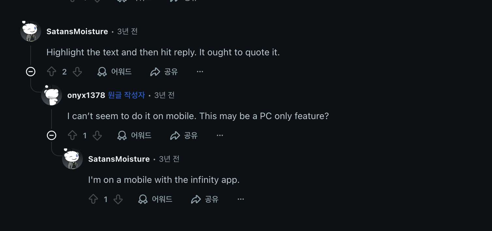

# 무한 대댓글 시스템 개발하기

## 무한 대댓글 시스템 개발하기

## 개요:

사용자가 게시글과 같은 데이터에 댓글을 달 수 있습니다. 그리고 댓글에 댓글을 달수있습니다. 그리고 대댓글에 또 대댓글을 달 수 있어요. 이런식으로 댓글에 대댓글을 달 수 있는 구조입니다.

## 기능적 요구 사항

- 사용자는 게시글에 댓글을 달 수 있다.
- 댓글에는 단순 텍스트만 포함 된다고 가정
- 아래와 같은 형식으로 구성이 된다.

```
- 댓글 1
	- 댓글 2
		- 댓글 3
			- 댓글 5
			- 댓글 6
			- 댓글 7
			- 댓글 8
				- 댓글 9
					- 댓글 10
						- 댓글 11
		- 댓글 4
		- 댓글 8
	- 댓글 12
	- 댓글 13
- 댓글 14

```

- 대댓글은 페이지네이션이 되어야 한다.
- 댓글 구조가 위와 같을때 10개 기준으로 페이징을 한다면 댓글 11번까지 첫번째 페이징이 된다고 고려
- 1페이지에는 11번 댓글까지 존재한다.
- 2페이지 에는 댓글 4번 부터 나머지 댓글이 노출

## 비기능적 요구 사항

- 특별한 요구 사항 없음
- 1 페이지에 대한 응답속도 300ms 이내

# 요구사항

- 댓글을 생성할 수 있다.
- 댓글을 수정할 수 있다
- 댓글을 삭제할 수 있다.
- 사용자와 상관없이 대댓글을 생성할 수 있다 ex)본인이 생성한 댓글에 대댓글 생성할 수 있다.
- 댓글을 페이지네이션 할 수 있다.
    - 이때 페이지네이션 LAST OFFSET 자식의 댓글을 모두 반환한다 (문제에 나온 예시)
    - 기존 댓글에 추가된 대댓글 & 댓글도 페이지네이션에 포함된다

# V1 생각 & 설계

무한 대댓글을 위해 댓글을 부모 댓글에 대한 외래키를 가지고 있으면 되지 않을까?

- sql
    
    ```sql
    Table post {
      id bigint [pk]
      member_id bigint
      content varchar(1024)
    }
    
    Table comment {
      id bigint [pk]
      member_id bigint
      content bigint
      comment_id bigint
      post_id bigint
      layer bigint
    }
    
    Table member {
      id bigint [pk]
      nickname bigint [pk]
    }
    
    Ref: comment.post_id > post.id
    Ref: comment.member_id > member.id
    Ref: post.member_id > member.id
    ```
    

```sql
CREATE TABLE member (
    id BIGINT PRIMARY KEY AUTO_INCREMENT,
    nickname VARCHAR(100) NOT NULL
);

CREATE TABLE post (
    id BIGINT PRIMARY KEY AUTO_INCREMENT,
    member_id BIGINT NOT NULL,
    content VARCHAR(1024),
    FOREIGN KEY (member_id) REFERENCES member(id)
);

CREATE TABLE comment (
    id BIGINT PRIMARY KEY AUTO_INCREMENT,
    member_id BIGINT NOT NULL,
    content VARCHAR(1024),
    comment_id BIGINT NULL, -- 대댓글(부모 댓글 id)
    post_id BIGINT NOT NULL,
		layer BIGINT NOT null, 
    FOREIGN KEY (member_id) REFERENCES member(id),
    FOREIGN KEY (post_id) REFERENCES post(id),
    FOREIGN KEY (comment_id) REFERENCES comment(id)
)

```


위와 같이 구성하는 경우 페이지네이션에 대해 해결 방법을 모색해야한다.

- 댓글을 생성할 수 있다. ✅
- 댓글을 수정할 수 있다 ✅
- 댓글을 삭제할 수 있다. ✅
- 사용자와 상관없이 대댓글을 생성할 수 있다 ex)본인이 생성한 댓글에 대댓글 생성할 수 있다. ✅
- 댓글을 페이지네이션 할 수 있다. ✅
    - 이때 페이지네이션 LAST OFFSET 자식의 댓글을 모두 반환한다 (문제에 나온 예시) ✅(대댓글 갯수만큼 N번의 쿼리 필요)
    - 기존 댓글에 추가된 대댓글 & 댓글도 페이지네이션에 포함된다 ✅

## 문제점

댓글 페이지네이션시 N번의 쿼리가 발생한다(댓글 PK를 외래키로 가지고 있는 댓글 계속 재귀적으로 검색해야함)

계선할 수 없는 부분이다(제가 판단했을때는 그렇습니다)

### ~~자식 대댓글을 모두 보여줘도 무방한가~~

~~무한 대댓글 서비스를 사용경험이 많지 않지만, 유튜브의 경우 특정 댓글에 대해서 150개 이상의 댓글이 달리는 경우가 있다(보통 말싸움) 이경우 대댓글에 대한 무한 스크롤을 지원하고 있는데 이렇게 해야되는거 아닌가라는 생각을 해본다~~ → 문제 잘못 이해

# V2 생각

## 참고하기

댓글은 위상이 존재한다. 위상간 가리킬 수 있다면 조회 횟수를 줄일 수 있다.

~~최대 대댓글 depth는 무한이면 화면이 어떻게 되는거지????~~



실제로 무한 대댓글을 사용하고 있는 Reddit 사이트를 살펴보았다.

Reddit에서는 Layer가 깊어지는 경우 별도의 댓글 페이지로 REDIRECT된다


원본


GrammatonYHWH에 대한 댓글 페이지

<aside>
💡

~~무한 대댓글을 한번에 보여주는 방법을 찾아내지 못한 관계로, 일정 Depth마다 페이지를 나누어 보여주는 것을 전제로 설계하겠다~~

</aside>

## 성능

외래키로 대댓글을 가리키게 되면 N번 쿼리를 피할 수 없고, 중간 댓글에 대한 새로운 대댓글 추가에 대해서도 Ramdom IO를 막을 수 없다.

## 데이터 크기

하나의 행: id(8B) + member_id(8B) + content(255B) + comment_id(8B) + post_id(8B) + layer(8B) = 287B * 50000000 = 1,435,000,000 → 1.435 GB

# V2 설계

~~일정 Depth에 대한 기준은 페이지네이션과 같이 클라이언트에서 파라미터로 받는다는 것을 전제~~

`~~GET comment?page=0&size=10&depth=3~~`

~~→ 10개 3 Depth 까지 허용 → 10번째 데이터가 2 Depth이고 대댓글 100개를 가지면?~~


## CTE

Common Table Expression으로 SQL 문장 내에서 한 번 이상 사용될 수 있는 임시 테이블이다(SQL 문자 종료되면 자동으로 CTE 임시 테이블 삭제)

```sql
WITH RECURSIVE cte (no) AS (
		SELECT 1
	UNION ALL
		SELECT (no + 1) FROM cte WHERE no < 5
	)
SELECT * FROM cte;
```

1. CTE 쿼리의 비 재귀적 파트의 쿼리를 실행
2. 1번의 결과를 이용해 CTE임시 테이블 생성
3. 1번의 결과를 CTE 임시 테이블에 저장
4. 1번 결과를 입력으로 사용해 CTE쿼리의 재귀적 파트의 쿼리 실행
5. 4번의 결과를 CTE라는 임시테이블에 저장(UNION 또는 UNION DISTINCT의 경우 중복 제거 실행)
6. 전 단계의 결과를 입력으로 사용해 CTE 쿼리를의 재귀적 파트 쿼리를 싷행
7. 6번 단계 쿼리 결과가 없으면 CTE 쿼리 종료
8. 6번 결과를 CTE라는 임시 테이블에 저장
9. 6번으로 돌아가서 반복 실행


CTE를 사용하는 경우 DB에 대한 네트워크 IO는 1회로 줄일수 있지만 내부적으로 임시테이블에서 재귀적 연산을 하기 때문에 사용량이 적지 않을 것으로 생각

그럼에도 Disk IO를 최대로 줄일 수 있는 방법이라고 생각한다(버퍼풀 페이지의 크기가 작거나, API 호출시 페이지가 너무 크는 경우 IO가 선형적으로 증가할 수 있지만 이는 CTE를 사용하는 것과 관련없음)

```sql
WITH RECURSIVE comment_tree AS (
    -- 1️⃣ 루트 댓글 (부모가 없는 댓글)
    SELECT 
        c.id,
        c.content,
        c.member_id,
        c.comment_id,
        c.post_id,
        c.layer,
        0 AS depth,
        CAST(c.id AS CHAR(200)) AS path
    FROM comment c
    WHERE c.comment_id IS NULL  -- 부모 댓글이 없는 것만 선택

    UNION ALL

    -- 2️⃣ 자식 댓글 (재귀적으로 탐색)
    SELECT 
        child.id,
        child.content,
        child.member_id,
        child.comment_id,
        child.post_id,
        child.layer,
        parent.depth + 1 AS depth,
        CONCAT(parent.path, ',', child.id) AS path
    FROM comment child
    INNER JOIN comment_tree parent ON child.comment_id = parent.id
)
SELECT 
    ct.id,
    ct.content,
    ct.member_id,
    ct.comment_id,
    ct.post_id,
    ct.layer,
    ct.depth
FROM comment_tree ct
ORDER BY ct.path
LIMIT 5 OFFSET 0;

+------+---------------------------------------+-----------+------------+---------+-------+-------+
| id   | content                               | member_id | comment_id | post_id | layer | depth |
+------+---------------------------------------+-----------+------------+---------+-------+-------+
|    1 | 맞아요! 산책하기 좋은 날씨예요.              |         2 |       NULL |       1 |     1 |     0 |
|    4 | 저도 동의해요!                           |         1 |          1 |       1 |     2 |     1 |
|   54 | 저도 동의해요!                           |         1 |          1 |       1 |     2 |     1 |
|   56 | 저도 동의합니다!                          |         3 |          1 |       1 |     2 |     1 |
|    2 | DDL 잘 동작하네요!                       |         3 |       NULL |       2 |     1 |     0 |
+------+---------------------------------------+-----------+------------+---------+-------+-------+
```

## 파티셔닝

파티션을 사용하기 적합한 상황

- 하나의 테이블의 크기가 매우 커서 인덱스의 크기가 물리적인 메모리보다 훨씬 큰 경우
- 데이터의 주기적인 삭제 작업이 필요한 경우
- 단일 INSERT에 대한 성능을 올리고자 할때

인덱스 데이터 크기 예상: Integer(4B) * 5000000= 20,000,000 = 20MB(리프노드를 제외한 중간노드, 외래키에 따른 세컨더리 인덱스는 계산에서 제외)

인덱스의 크기가 커서 인덱스에 대한 DISK IO 발생


MySQL InnoDB환경에서 파티션을 사용하려면 외래키를 사용할 수 없다고 한다. 따라서 외래키 제약 조건을 제외하고 사용해야한다.

### 파티셔닝 종류

레인지 파티션: 중간 대댓글 가능하기 때문에 적합하지 않음

리스트 파티션: 직접 파티션 키 값을 설정하는 거라 오버헤드

해시 파티션: 해시값

키 파티션: MySQL 내부적으로 직접 파티션 함수 정의