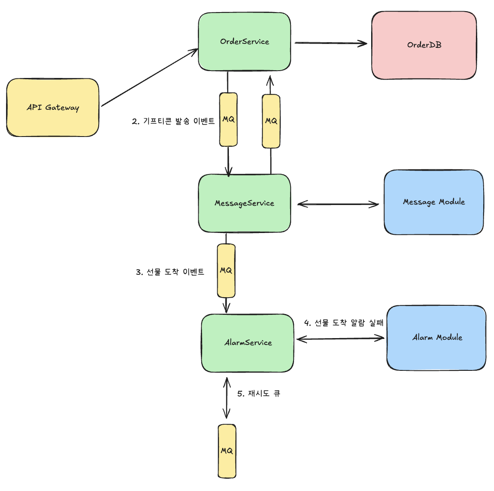

# 5주차 카카오톡 선물하기 시스템 개발하기

# 문제

## 기능적 요구사항

### 1. 선물 예약 기능

- 사용자는 **특정 날짜/시간**에 선물이 발송되도록 예약할 수 있다
- 예약 가능 기간: **최소 10분 후 ~ 최대 1년 후**
- 발송 시간 지정: **날짜 + 시간** 또는 **날짜만 (기본 00:00)**
- 개인 메시지 첨부 가능 (최대 500자)
- 수신자 정보: 전화번호 또는 카카오톡 ID

### 2. 선물 발송 처리

- 예약 시간에 **정확히 (±1분 이내)** 발송
- 발송 방식: 카카오톡 메시지, SMS, 이메일
- **기프티콘 번호 자동 생성** 및 전달
- 발송 실패 시 **자동 재시도** (최대 3회)

### 3. 선물 수령 및 사용

- 수신자는 메시지 내 링크로 선물 확인
- **30일 내 사용** 기한 (상품별 상이)
- 사용 전 **타인 양도 가능** (1회 한정)
- 미사용 시 **자동 환불** 처리

### 4. 예약 관리 기능

- 예약 내역 **조회 및 상세 확인**
- 발송 **전까지 취소 가능** (취소 수수료 없음)
- 발송 **1시간 전까지 수정 가능** (수신자, 메시지, 시간)
- 예약 상태 실시간 추적

### 5. 알림 기능

- 발송자: 예약 확인, 발송 완료, 수령 확인
- 수신자: 선물 도착, 만료 임박 (D-3, D-1)
- 알림 채널: 앱 푸시, 카카오톡, SMS

### 📊 규모 및 성능 요구사항

| 일 예약 건수 | 5만건 | 50만건 |
| --- | --- | --- |
| 동시 접속자 | 5천명 | 5만명 |
| 시간당 발송 | 2천건 | 2만건 |

### **피크 타임 (실생활 패턴)**

`🎄 12월 (크리스마스): 평소 대비 10배 ↑ 💝 2월 14일 (밸런타인데이): 당일 00시 집중 (50배 ↑) 🎂 생일 시즌: 매일 오전 9시, 자정 집중 🧧 설날/추석: 명절 당일 오전 집중`

### **특정 시간대 집중도**

- **자정 (00:00)**: 전체 트래픽의 **30%** (생일 발송)
- **오전 9시**: 전체 트래픽의 **15%** (아침 인사)
- **저녁 8시**: 전체 트래픽의 **10%** (퇴근 시간)

### **성능 요구사항**

- 예약 등록 응답 시간: **500ms 이내**
- 발송 정확도: 예약 시간 **±1분 이내**
- 발송 성공률: **99% 이상**
- 알림 지연 시간: **30초 이내**

## 비기능적 요구사항 (Non-Functional Requirements)

### **정확성 (Accuracy)**

- **발송 시간 준수**: 예약 시간 오차 ±1분 이내
- **중복 발송 방지**: 동일 선물 1회만 발송 (멱등성)
- **결제 정합성**: 예약-발송-환불 금액 일치
- **데이터 일관성**: 예약 정보와 발송 이력 동기화

### **확장성 (Scalability)**

- **수평 확장**: 발송 서버 동적 증설 가능
- **피크 대응**: 평소 대비 **10배 트래픽** 처리
- **지역별 확장**: 글로벌 서비스 고려 (시간대)

### **가용성 (Availability)**

- **서비스 가용률**: **99.9%** 이상
- **장애 복구**: 예약 데이터 유실 방지
- **발송 보장**: 장애 복구 후 놓친 예약 자동 처리
- **Graceful Degradation**: 부분 장애 시 핵심 기능 유지

## **핵심 설계 고민 포인트**

### 💭 **고민 1: 미래 시점 작업 스케줄링**

`수십만 건의 예약을 정확한 시간에 실행하려면?`

### 💭 **고민 2: 피크 시간대 대응**

`자정(00:00)에 수만 건이 동시 발송되어야 한다면?`

### 💭 **고민 3: 취소와 환불 처리**

`발송 직전에 취소 요청이 들어온다면?`

### 💭 **고민 4: 발송 실패 처리**

`발송 실패 시 재시도 전략은?`

### 💭 **고민 5: 시간대(TimeZone) 처리**

`한국에서 미국 친구에게 생일 자정 선물?`

## 요구사항

- 사용자는 선물을 예약할 수 있다.
- 예약 시간은 예약일 기준 ~1년
- 발송 시간을 결정할 수 있다.
- 선물에 메세지를 추가할 수 있다(텍스트 최대 500자)
- 선물은 수신자 정보를 가지고 있다.
- 예약 당 하나의 상품만 주문할 수 있다.
- 선물은 예약 시간에 정확하게 발송된다.
- 발송은 카카오톡, 메세지, SMS, 이메일
- 기프티콘 번호를 자동으로 생성해야한다.
- 발송 실패 시 자동 재시도 해야한다(3회)
- 수신자는 메세지 링크로 선물을 확인할 수 있다.
- 기프티콘은 30일 내에 사용할 수 있다.
- 사용 전 양도 할 수 있다.
- 미사용 시 자동 환불 처리 된다.
- 예약 내역을 조회 할 수 있다.
- 발송 전에 예약 내역을 취소할 수 있다.
- 발송 1시간전까지 예약 내역을 수정할 수 있다(시간)
- 예약 상태를 실시간으로 추적할 수 있다.
- 예약 상태를 알림을 전송한다.
- 선물 수신자에게 알림을 전송한다.

# V1 선물 예약

선물 예약 부터 생각해보자

```sql
Table member {
  id bigint [pk]
  nickname bigint [pk]
}

Table product {
  id bigint [pk]
  name varchar(255)
  price bigint
}

Table order {
  id bigint [pk]
  name varchar(255)
  reservation_date datetime
  product_id bigint
  member_id bigint
}

Table order_sender{
  id bigint [pk]
  name varchar(255)
  order_id bigint
}

Table order_recipient{
  id bigint [pk]
  name varchar(255)
  order_id bigint
}

Ref: order.product_id > product.id
Ref: order.member_id > member.id
Ref: order_sender.order_id > order.id
Ref: order_recipient.order_id > order.id
```


배송 예약 일자를 `reservation_date` 으로 날짜와 시간을 한번에 관리 (분리되서 입력 받는 값이 아니기 때문에)

`예약 당 하나의 상품만 주문할 수 있다.` 으로 제한하였지만 여러개의 상품으로 하나의 예약을 허용한다면 조인 테이블 추가

주문자와 수신자 테이블 별도로 분리( 사용자가 직접 입력할 수 있게)

# V2 선물 발송 처리

```sql
Table order_gift {
  id bigint [pk]
  order_id bigint
  gift_number varchar(100) [unique]
  status order_gift_status [not null, default: 'PENDING']
}

Enum order_gift_status {
  PENDING 
  SENT
  USED
  EXPIRED
  CANCELLED
}
```


기프티콘을 위한 `order_gift` 테이블 추가

기프티콘 번호 생성 관련 문제는 고려하지 않았다

### 지연되어선 안되는 발송 이벤트(피크 타임)

발송 이벤트는 지연되어선 안된다

| **일 예약 건수** | **5만건** | **50만건** |
| --- | --- | --- |
| 동시 접속자 | 5천명 | 5만명 |
| 시간당 발송 | 2천건 | 2만건 |

피그 타임에는 동시 접속자가 5만명이 될 수 있다(또는 그 이상)

주기적으로 DB를 풀 스캔하는 것은 지연을 발생시킴

### 발송 이벤트를 캐시

선물 관련 데이터(기프티콘 정보)를 Redis와 같은 캐시로 관리할 수 있다. 스캔에 대한 오버헤드를 줄일 수 있다.

Sorted Set을 통해 특정 기간에 대한 엔티티를 조회할 수 있다.

Softed Set으로 주문 시간 기준으로 데이터 생성후, 값에 주문 ID를 저장하여 HGET으로 주문 데이터 값을 조회

```sql
ZRANGEBYSCORE orders_by_time 1730400000 1730410000
HGETALL order:result
```

시간 복잡도 O(Log(N) + N) + O(1) = O(N)

### 주문 부터 발송까지

주문 시간 확인 → 선물(기프티콘) 생성 → 메세지 까지 빠른 시간(1분 이내)를 보장해야함

저장한 선물 이벤트에 해당하는 기프티콘 데이터를 주문 생성시 미리 Redis에 추가하여 오버헤드를 예방한다.

Redis에 모든 주문 내역을 저장하지 않고, 주기적으로 Redis에 데이터를 업로드한다 ex) 배송까지 하루 남은 데이터

따라서 선물 시간 확인 → 메세지 까지만 빠른 응답 시간을 보장하며 됨

Redis으로 조회 성능을 올리더라도 요청을 처리하는 쓰레드로 인한 병목이 발생할 수 있음

비동기 처리(MQ)를 통해 쓰레드 병목을 예방할 수 있음


다만 분리된 서비스에 대해서 시간을 보장하는 방법을 모르겠음

### 실패 케이스(트랜잭션)

서비스가 분리되어 있는경우 다른 서비스에 대한 장애가 발생할 수 있다.

예를 들어 알람 서비스에서 알람에 대한 처리 속도가 처리해야할 알람 갯수보다 느린경우 이다.

https://firebase.google.com/docs/cloud-messaging/scale-fcm?hl=ko

기프티콘에 대한 메세지를 받는 것이 성공적으로 발송한 것과 같다.

만약 메세지를 받지 못했다면, 발송자는 선물 배송 취소로 이벤트를 전달해야한다.

메세징 처리에 대한 실패 시, 실패 Queue에 넣어 3번 재시도, 실패시 보장 트랜잭션을 통해 주문 상태 실패 표시 또는 환불

https://www.youtube.com/watch?v=xpwRTu47fqY


# V3 **선물 수령 및 사용**

기존 ERD에서 `transfer_count`  추가하는 것으로 구현 가능

양도시, 외래키 변경

환불 처리에 대해서는 빠른 응답 시간을 보장하지 않아도 되기 때문에 크게 고려하지 않음


# V4 예약 관리 기능

취소 또는 수정 요청에 대해서는 동기적으로 RDB와 Redis에 수정한다

예약 상태를 V2에서 보장 트랜잭션을 관리하고 있음

# V5 알림 기능

알림 실패에 대해서는 보상 트랜잭션에 포함하지 않고, 재시도 큐에 넣고 다시 시도

알림 실패로 선물 도착 유무의 상태는 변경되지 않아야 하기 때문

